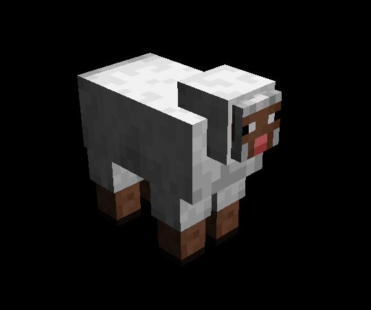
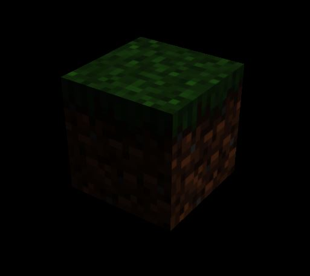
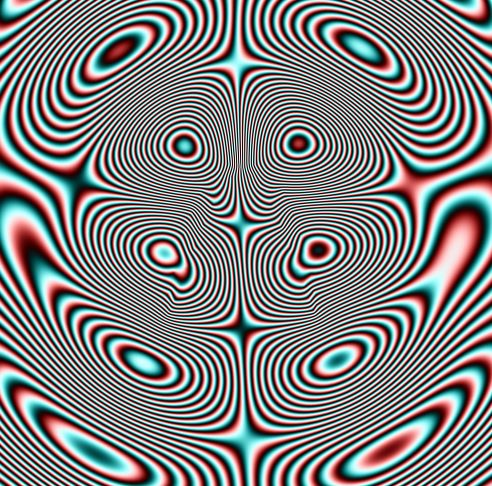

# Índice

1. [Descripción de la Práctica](#descripción-de-la-práctica)  
2. [Estructura del Proyecto](#estructura-del-proyecto)  
3. [Shaders](#shaders)  
4. [Imagenes y Video](#imagenes-y-video)

# Descripción de la Práctica

El proyecto incluye **dos tipos de shaders**:

1. **Shader de iluminación estilo Minecraft**: aplicado a modelos 3D como bloques y animales. Permite añadir iluminación difusa, especular y ambiental sobre los modelos cargados desde archivos `.glb`.  
2. **Shader fragmentado**: un shader procedural que genera patrones abstractos dinámicos usando funciones trigonométricas (senos y cosenos) sobre un plano, creando efectos visuales coloridos y animados.

Para utilizar uno u otro shader, se debe cargar el correspondiente archivo `.js` (`shader-minecraft.js` o `shader-fragmentado.js`) en el HTML.

# Estructura del Proyecto

El proyecto se organiza principalmente en archivos JS que manejan la escena 3D, los shaders y la interacción del usuario:

- **index.js**  
  Inicializa la escena, la cámara, el renderer, los controles de cámara y carga de modelos 3D. Sirve como punto de entrada para ambas escenas/shaders.

- **Elementos de la escena**
  - `scene`: Escena principal de Three.js.  
  - `camera`: `PerspectiveCamera` para el punto de vista.  
  - `renderer`: `WebGLRenderer` para renderizar la escena.  
  - `camcontrols1`: `OrbitControls` para mover y hacer zoom en la escena.

- **Objetos 3D (shader Minecraft)**
  - `objetos`: Array que almacena todos los modelos 3D cargados actualmente para poder eliminarlos al cambiar de modelo.  

- **Interfaz de usuario (shader Minecraft)**
  - `dat.GUI`: Permite seleccionar el modelo a visualizar (Tierra, Piedra, Madera, Hielo, Oveja, Cerdo, Slime).  
  - `params.tipoCubo`: Variable vinculada al GUI que indica el modelo seleccionado.  
  - `cubos`: Objeto que mapea nombres de modelos a rutas de archivos `.glb`.

- **Shaders**
  - **Shader Minecraft**: Se aplica un `ShaderMaterial` a cada mesh del modelo 3D para iluminación personalizada.  
  - **Shader fragmentado**: Se aplica a un plano y genera patrones abstractos y animados sin necesidad de modelos 3D.

- **Funciones principales**
  - `init()`: Inicializa la escena, cámara, renderer, controles y carga del modelo o plano inicial.  
  - `ModelShader(path, px, py, pz, scale)`: Carga un modelo `.glb`, recorre sus meshes y aplica un shader (solo Minecraft).  
  - `vertexShader() / fragmentShader()`: Devuelven el código GLSL del vertex o fragment shader correspondiente.  
  - `animationLoop()`: Bucle de animación que actualiza `u_time` de los shaders y renderiza la escena cada frame.

# Shaders

El proyecto utiliza **shaders** para modificar visualmente los objetos o planos en la escena, aplicando efectos de iluminación o patrones generativos.

## Shader Minecraft

El **shader de Minecraft** se aplica a modelos 3D (`.glb`) y simula iluminación realista sobre sus superficies.

### Vertex Shader

El **vertex shader** transforma los vértices del modelo y calcula las normales necesarias para la iluminación:

- `vUv`: Coordenadas UV del vértice, pasadas al fragment shader para acceder a la textura.  
- `vNormal`: Normal transformada al espacio de cámara para calcular iluminación difusa y especular.  
- `gl_Position`: Posición final del vértice en pantalla.

### Fragment Shader

El **fragment shader** calcula el color final de cada píxel:

- `texColor`: Color tomado de la textura del modelo usando UV.  
- `lightDir`: Dirección de la luz.  
- `viewDir`: Vector desde el fragmento hacia la cámara.  
- `normal`: Normal transformada al espacio de cámara.  
- `diff`: Componente de luz difusa (Lambert).  
- `spec`: Componente especular (Phong).  
- `ambient`: Componente de iluminación ambiental constante.  
- `color`: Suma de iluminación difusa, especular y ambiental multiplicada por el color de la textura.  
- `gl_FragColor`: Color final renderizado en pantalla.

---

## Shader Fragmentado

El **shader fragmentado** se aplica a un plano y genera patrones abstractos animados de manera procedural.

- Usa funciones trigonométricas (senos y cosenos) para generar patrones en movimiento.  
- `u_time`: Uniform que controla la animación del patrón.  
- `u_resolution`: Uniform que define la resolución de la pantalla para calcular correctamente las coordenadas de fragmento (`gl_FragCoord`).  
- El resultado son **efectos visuales dinámicos**, como plasma, cristales vibrantes o fractales animados.  

# Imagenes y Video

## Shader Minecraft

En la siguiente imagen podemos ver que sin utilizar ninguna herramienta para crear puntos de luz en Three.js, la oveja se ilumina
simulando diferentes tipos de luces (ambiente, especular ...)

Lo mismo pasa con el resto de modelos 3D, que en este caso son todos de "Minecraft" pero podría servir para cualquier modelo.

## Shader Fragmentado

El siguiente shader fragmentado ocupa 407Bytes  

## Video  

https://drive.google.com/file/d/1-7327ooDSzVThyOMIuQTWnZXQ13uxYp5/view?usp=sharing
